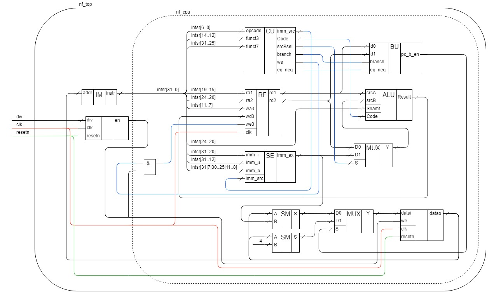

# **nanoFOX**
    A small RISC-V CPU core with lw and sw instructions.
## Supported instructions:
*   lui
*   slli
*   addi
*   add
*   sub
*   or
*   beq
*   lw
*   sw

## Quickstart:
For loading project with git program:

    $ git clone https://github.com/Dmitriy0111/nanoFOX.git 
    $ cd nanoFOX 
    $ git checkout 01_simple_risc_v_cpu_lwsw 
    $ git submodule update --init --recursive 

Or download project from GitHub site <a href="https://github.com/Dmitriy0111/nanoFOX">01_simple_risc_v_cpu_lwsw</a>, <a href="https://github.com/Dmitriy0111/DebugScreenCore">DebugScreenCore</a>

For working with project install:
*   make
*   Quartus Prime
*   Modelsim
*   Python
*   RISC-V tools for <a href="https://">windows</a> or <a href="https://">linux</a>

**Impotant:** Before starting simulation or synthesis process make compilation program or create "program_file" folder and copy one of program.hex files from program folder.

## Compilation program:
*   **set PROG_NAME="name of folder with main program"** is used for setting current program. For example "set PROG_NAME=02_running_bit";
*   **make prog_comp_win** is used for compiling program on windows machine;
*   **make prog_comp_lin** is used for compiling program on linux machine;
*   **make prog_clean** is used for cleaning compilation results folder.

## Simulation:
*   **make sim_dir** is used for creating simulation folder;
*   **make sim_clean** is used for cleaning simulation result;
*   **make sim_cmd** is used for starting simulation in command line (CMD) mode;
*   **make sim_gui** is used for starting simulation in graphical user interface (GUI) mode.

If log_en or log_html set as '1 (tb/nf_tb.svh) then you can see simulation results in log folder (log/.log and log/log.html).

## Synthesis:
*   **make synth_create** is used for creating synthesis folder for default board;
*   **make synth_clean** is used for cleaning synthesis folder;
*   **make synth_build_q** is used for building project;
*   **make synth_gui_q** is used for open project in Quartus;
*   **make synth_load_q** is used for loading bitstream in CPLD/FPGA.

For selecting debug output (VGA or hex_display) change in verilog board file (board/[board name]/[board name].sv) value ("hex" or "vga") of localparam in string:
```verilog
localparam              debug_type  = "hex";
```

## Core structure:


## Boards support:
simple cpu nanoFOX currently works on these FPGA boards:
<ol>
<li>Storm_IV_E6_V2 ( Altera Cyclone IV FPGA )</li>
<li>rz_easyFPGA_A2_1 ( Altera Cyclone IV FPGA )</li>
<li><a href="https://www.terasic.com.tw/cgi-bin/page/archive.pl?Language=English&CategoryNo=234&No=1021">Terasic DE10-Lite ( Altera MAX10 FPGA )</a></li>
<li><a href="https://www.terasic.com.tw/cgi-bin/page/archive.pl?No=593">Terasic DE0-Nano ( Altera Cyclone IV FPGA )</a></li>
</ol>

## Repository contents:
| Folder        | Contents                                          |
| :------------ | :------------------------------------------------ |
| board         | Top levels of design for fpga development boards  |
| brd_rtl       | Auxiliary modules for top levels                  |
| doc           | RISC-V ISA 2.2                                    |
| inc           | Header files for design                           |
| program       | Examples of programs                              |
| rtl           | Core source files                                 |
| run           | Scripts for simulation                            |
| tb            | Testbenches for core and separate parts           |
| other         | Readme and license files, Makefile                |

## Planns
*   Adding Xilinx support
*   Adding other Altera boards support
*   Adding docs
